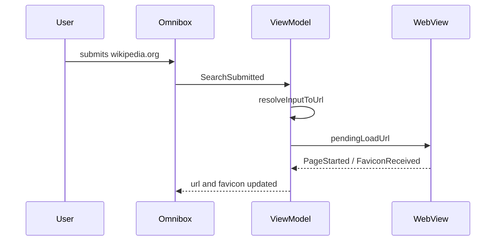

# Sparrow Browser

A lightweight general-purpose Android browser built with **Kotlin**, **Jetpack Compose**, and **WebView**. Sparrow loads any URL or search term, supports multi-tab browsing, and keeps the toolbar in sync with real WebView navigation state.

## Features

- **Persistent browser chrome** — top bar (back, forward, omnibox, reload/stop) and bottom bar (home, new tab, tabs, menu) stay visible while content changes
- **Omnibox** — search or enter URLs; shows favicon, HTTPS lock, or search icon
- **Multi-tab browsing** — up to 10 tabs with history preserved per tab
- **Tab switcher** — grid of tab cards with thumbnails, titles, and close buttons
- **Loading state** — animated progress bar under the top bar; reload/stop toggle
- **Error state** — full-page error overlay with retry; omnibox keeps the failed URL
- **Home start page** — Sparrow branding with shortcut cards (Wikipedia, Daily News, Kotlin Docs)
- **System back** — WebView history first; closes tab switcher when open

## Architecture

Lean **MVVM / MVI** — one `BrowserViewModel` handles all user and WebView events via `BrowserIntent`. UI state lives in `BrowserUiState`; per-tab fields live on `Tab`.

```
Scaffold
├── BrowserTopBar          (status bar inset)
│   ├── NavButtons
│   ├── Omnibox
│   ├── ReloadStopButton
│   └── LoadProgressBar
├── Content area
│   ├── MultiTabWebViewLayer   (one WebView per tab)
│   ├── HomeStartContent       (overlay on home URL)
│   ├── ErrorContent           (overlay on load failure)
│   └── TabSwitcherScreen
└── BrowserBottomBar       (navigation bar inset)
```

### Data flow



### Key files

| Path | Role |
|------|------|
| `ui/BrowserViewModel.kt` | Intent handling, tab lifecycle |
| `ui/BrowserUiState.kt` | App + active-tab state helpers |
| `ui/components/MultiTabWebViewLayer.kt` | One WebView per tab in composition |
| `webview/WebViewHolder.kt` | WebViewClient / WebChromeClient bridge |
| `util/UrlResolver.kt` | URL vs search resolution (Google default) |
| `model/Tab.kt` | Per-tab state model |

## Tech stack

- Kotlin, Jetpack Compose, Material 3
- Hilt for DI
- Navigation Compose
- Android WebView (no third-party browser libraries)

## Getting started

**Requirements:** Android Studio Ladybug or newer, JDK 17, Android SDK 36

```bash
./gradlew assembleDebug
./gradlew test
```

Install the debug APK on a device or emulator (API 24+).

## Manual test checklist

- [ ] Top and bottom bars visible on home, browsing, and error states
- [ ] Omnibox shows favicon after page load
- [ ] Omnibox updates when tapping in-page links
- [ ] Home button returns to start page with shortcuts
- [ ] Back/forward disabled at history bounds
- [ ] System back walks WebView history
- [ ] Progress bar animates during load
- [ ] Reload/stop toggle works
- [ ] Error overlay with retry on unreachable URLs
- [ ] Tab count badge updates (max 10 tabs)
- [ ] Shortcut cards open correct sites
- [ ] 3+ tabs preserve history and scroll position

## Project structure

```
app/src/main/java/com/example/emptyproject/
├── MainActivity.kt
├── model/          Tab, Shortcut, PageLoadState
├── util/           UrlResolver, BrowserConstants
├── webview/        WebViewHolder
└── ui/
    ├── BrowserViewModel.kt
    ├── BrowserUiState.kt
    ├── BrowserIntent.kt
    ├── components/   chrome, omnibox, tab switcher, shortcuts
    ├── screens/      BrowserShell
    └── theme/        colors, dimens
```
